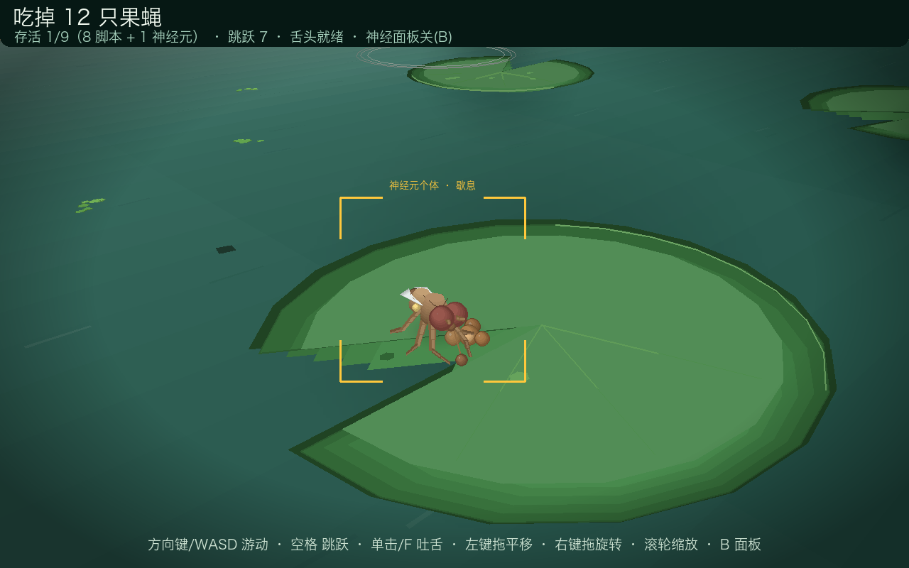

# 🧠 Fly Brain Pond 3D 🐸🪰

### A hand-written 3D pond with nine fruit flies — and exactly one of them thinks with spiking neurons.

You play a frog: hop across lily pads, flick your tongue, and hunt. Eight of the flies are
ordinary scripted NPCs. The ninth — the one wearing the gold box — runs on a leaky
integrate-and-fire network: giant-fibre escape, central-complex steering, and a rest circuit
that gates feeding. Press `B` and you can watch its membrane potentials charge toward threshold
while you close in on it.


[English](README.md) · [简体中文](README.zh-CN.md)


*The gold-outlined fly is the only one driven by a spiking network. The panel on the right is
its four circuits charging toward threshold in real time — here the frog has walked inside GF's
170-unit escape radius and the giant-fibre bar is almost full.*

---

## Contents

- [The individual — 神经元个体](#the-individual--神经元个体)
- [Where this sits in the fruit-fly brain moment](#where-this-sits-in-the-fruit-fly-brain-moment)
- [The real fly: FlyGym / NeuroMechFly](#-the-real-fly-flygym--neuromechfly)
- [The pond: quick start, controls, foraging](#the-pond)
- [How the 3D works](#how-the-3d-works)
- [Project layout](#project-layout) · [Regression test](#regression-test) · [Notes](#notes-and-limitations)

---

## The individual — 神经元个体

Every fly in the pond flies, walks, feeds and grooms. One of them also *decides*. The brain
([`fly_brain.py`](fly_brain.py)) is a small spiking network of leaky integrate-and-fire neurons,
integrated with sub-stepping every frame — and it is not decoration: the fly does nothing until
a circuit fires.

| Circuit | Role | Tau | Fires when |
|---|---|---|---|
| **GF** — giant fibre | Escape reflex | 0.05 s | The frog closes within ~170 units, or a hop shadow sweeps past → full-speed flight for 0.85 s + 1.6 s refractory |
| **CX_L / CX_R** — central complex | Steering | 0.25 s | Left/right oscillators compete; their difference, with inertia, produces smooth non-repetitive cruising |
| **REST** — rest circuit | Feeding gate | 0.6 s | Membrane charges slowly while hovering over a crumb; crossing threshold releases the landing manoeuvre. Takes off again after 2.5 s without food, or 12 s of resting |
| Olfactory bias | Navigation | — | When hungry, headings are nudged toward the nearest crumb |

Threshold is −52 mV, resting potential −70 mV. The `B` panel draws one bar per neuron showing
how far it is from firing, so you can literally watch GF charge as you walk the frog toward the
gold fly — and watch it drain again after the fly bolts.

The other eight flies ([`ScriptedFly`](main.py)) are waypoint NPCs: forage → land → chew, and if
the frog comes within 110 units they run. The neural fly reacts from much farther away, because
its threshold, not a script, decides when it has had enough of you.

## Where this sits in the fruit-fly brain moment

*Drosophila* has quietly become the most exciting model system in neuroscience — it is the first
animal with a **complete adult brain wiring diagram**, and those wiring diagrams are now being
wired into simulated bodies.

- **2024 — the whole brain, mapped.** FlyWire reconstructed an adult brain containing
  **139,255 neurons and ~5 × 10⁷ chemical synapses**, then annotated it into cell types.
- **2024 — the whole brain, running.** Connectome-constrained models reproduced real
  sensorimotor processing (sugar sensing and feeding) and predicted single-neuron responses
  across the visual system.
- **2024–2025 — the brain, embodied.** NeuroMechFly v2 and FlyBody put a physics-simulated fly
  under a neural controller, the latter wiring muscles to connectome-derived motor neurons.

This repo is the fun-size end of that spectrum: four neurons, 60 FPS, no GPU, no engine — a fly
you can actually chase around a pond with a frog. And because a cartoon shouldn't be the only
thing here, the repo **also installs and renders the real NeuroMechFly body**, including its
compound-eye readout. Going from the 4-neuron cartoon to the scientific model is one command
([below](#run-it)).

### Standing on the shoulders of

| Project | What it gives you | Where |
|---|---|---|
| **FlyWire** — whole-brain connectome of an adult female fly: 139,255 neurons, ~5 × 10⁷ chemical synapses | the wiring diagram everything else is built on | [Dorkenwald et al., *Nature* 634, 124–138 (2024)](https://doi.org/10.1038/s41586-024-07558-y) · [flywire.ai](https://flywire.ai) · [annotations repo](https://github.com/flyconnectome/flywire_annotations) |
| **Whole-brain annotation & cell typing** | names, types and stereotypy for every one of those neurons | [Schlegel et al., *Nature* 634, 139–152 (2024)](https://doi.org/10.1038/s41586-024-07686-5) |
| **fly-brain — a computational brain model** | connectome-driven simulation that reproduces sugar sensing and feeding behaviour | [Shiu et al., *Nature* 634, 210–219 (2024)](https://doi.org/10.1038/s41586-024-07763-9) |
| **Hemibrain connectome** | the central-brain reconstruction that started the fly-connectome era | [Scheffer et al., *eLife* 9:e57443 (2020)](https://doi.org/10.7554/eLife.57443) |
| **Male nerve cord connectome (MANC)** | descending commands becoming walking — the motor side of the loop | [Takemura et al., *eLife* (2024)](https://doi.org/10.7554/eLife.97769) |
| **NeuroMechFly v2 / FlyGym** | the embodied neuromechanical fly — **the model installed and rendered here** | [Wang-Chen et al., *Nature Methods* 21, 2353–2362 (2024)](https://doi.org/10.1038/s41592-024-02497-y) · [neuromechfly.org](https://neuromechfly.org) · [NeLy-EPFL/flygym](https://github.com/NeLy-EPFL/flygym) |
| **FlyBody** | whole-body physics with connectome-derived neuromuscular wiring | [Vaxenburg et al., *Nature* (2025)](https://doi.org/10.1038/s41586-025-09029-4) · [TuragaLab/flybody](https://github.com/TuragaLab/flybody) |
| **Connectome-constrained deep mechanistic networks** | predicting single-neuron visual responses from the optic-lobe wiring | [Lappalainen et al., *Nature* 634 (2024)](https://doi.org/10.1038/s41586-024-07939-3) · [TuragaLab/flyvis](https://github.com/TuragaLab/flyvis) |

## 🧬 The real fly: FlyGym / NeuroMechFly

The model below is **not a game asset**. It is assembled by
[`real_fly_demo.py`](real_fly_demo.py) from the micro-CT meshes shipped with
[FlyGym](https://neuromechfly.org), the EPFL platform for embodied *Drosophila* sensorimotor
research, and rendered offscreen in MuJoCo.


### Mechanics — a fly you can push, pull and grip with

| What | In the model |
|---|---|
| **Body** | 70 body segments from a **micro-CT scan of a real fly**: head and proboscis, antennae (pedicel / funiculus / arista), a six-segment abdomen, halteres, wings, and six seven-link legs |
| **Joints** | **126 rotational DOF** with per-joint stiffness, damping and armature. `JointPreset.ALL_BIOLOGICAL` gives each leg 11 (coxa 3, trochanterfemur 2, tibia 1, tarsus 1–5 one each — the distal tarsal joints are passive, as in the animal) |
| **Actuators** | **132** in the demo build: one position actuator per DOF (the muscle proxy that tutorials drive with CPGs, inverse kinematics or RL), plus **6 adhesion actuators on the tarsus5 tips** — ctrl 0→1 lets the fly stick to or release from a surface |
| **Contact** | per-body-segment contact presets, per-leg ground-contact sensors, and per-segment contact-force readouts |
| **Physics** | MuJoCo 3.9 at a 1 ms timestep; `flygym[warp]` swaps in a MuJoCo-Warp backend that steps thousands of flies in parallel |

Two more body models share the same API: **FlyBody** ([above](#standing-on-the-shoulders-of))
adds wing pitch/roll/yaw and abdomen DOF through tendon actuators with biomechanically calibrated
joint parameters, and **FlyMimic / `MusculoskeletalFly`** drives the left front leg with 15
Hill-type muscles and 15 spatial tendons.

### Neuro — sense → circuit → muscle

FlyGym is a neuroscience platform first: every channel a neural circuit needs is exposed.

- **Vision** — `add_vision()` puts a camera inside each compound eye: **157° FOV, 721 ommatidia
  per eye**, with hex sampling and fisheye distortion matched to the real optics. Readouts come
  back split by the two ommatidia types (yellow / pale).
- **Proprioception** — joint angles and velocities for all 126 DOF, plus body and joint-site poses.
- **Mechanosensation** — contact forces per body segment, i.e. what each foot is feeling.
- **Motor side** — 126 joint targets plus 6 adhesion channels. In FlyBody the wiring itself is the
  published connectome-derived motor-neuron → muscle map.


*Left: the left eye camera (fisheye-corrected) — the fly's own foreleg and a block terrain.
Right: the same frame sampled through the 721-ommatidia mosaic, R = yellow type, G = pale type.
That mosaic, not a rectangular image, is what a fly's brain actually receives.*

### Run it

```bash
python3.12 -m venv .venv-flygym                    # flygym 2.1.0 wants Python 3.12+
.venv-flygym/bin/pip install -r requirements-flygym.txt
.venv-flygym/bin/python real_fly_demo.py           # writes both PNGs above
```

The script prints the model it assembled:

```
NeuroMechFly: 70 个体节 / 126 个关节自由度 / 132 个执行器（含 6 个足端附着）/ 2 个复眼相机
```

The game fly runs at 60 FPS on pure pygame; this one is a physics simulation — a second or two
per rendered frame, and about a minute on the first run while Numba JIT-compiles the retina.
`pip install "flygym[warp]"` adds the GPU backend; `"flygym[rl]"` adds Gymnasium +
Stable-Baselines3 if you want to train locomotion policies against it.

### In-game fly vs. the real model

| | In-game fly ([`fly_brain.py`](fly_brain.py)) | FlyGym / NeuroMechFly |
|---|---|---|
| Body | a few dozen hand-written polygons | 70 micro-CT meshes |
| "Brain" | 4 LIF neurons (GF / CX_L / CX_R / REST) | whatever circuit you bring — the model supplies body, senses and muscles |
| Vision | none — the fly "sees" by distance checks | 721 ommatidia per eye, hex + fisheye |
| Time | 60 FPS real time | MuJoCo physics, 1 ms steps |
| Purpose | a game | neuroscience, biomechanics, RL |

## The pond

### Quick start

Requires Python 3.10+ (developed on 3.14). Nothing but `pygame` and `numpy` — no engine, no
OpenGL, no assets: every polygon is projected, depth-sorted and drawn by hand in
[`render3d.py`](render3d.py).

```bash
git clone https://github.com/yjiao286/fly-brain-pond.git
cd fly-brain-pond

python -m venv .venv
.venv/bin/pip install -r requirements.txt   # Windows: .venv\Scripts\pip

.venv/bin/python main.py
```

### Controls

| Input | Action |
|---|---|
| Arrow keys / `WASD` | Swim in the direction you push (the frog turns to face it) |
| `Space` | Hop — anything within 60 units of the landing spot is squashed |
| Left click / `F` | **Flick tongue** at the nearest target ahead (holding and dragging the left button pans the camera instead — no accidental tongue) |
| Right-drag | Orbit the camera — horizontal drag circles the pond, vertical drag sets the pitch between 10° and 62° |
| Mouse wheel | Zoom in / out |
| `B` | Neural panel: live GF / CX_L / CX_R / REST activation bars plus a legend |
| `M` | Mute |
| `F11` | Fullscreen / windowed |
| `Esc` | Quit |

### Foraging loop

Crumbs grow on random lily pads. Flies smell them, hover, and then land to chew — a pad's crumb
shrinks and disappears when eaten, and a new one sprouts on some pad 8–14 s later. A fly that is
busy feeding or grooming is **not** watching you, which is exactly when to flick your tongue.
Everything else in the pond is scenery, drawn by [`scenery.py`](scenery.py): caustics, ripples,
bobbing lily pads, lotus flowers, duckweed, sand banks, rocks, reeds, bulrushes and bushes.


### The flies' behaviour and animation

Each fly is modelled in 3D — three-segment abdomen, bristled thorax, head with antennae and
compound eyes, six hip→knee→foot two-segment legs, veined wings — with a distinct animation per
state: **flying** (wings beating, legs tucked), **walking** (tripod gait, step frequency following
speed), **feeding** (mouthparts to the crumb, front legs rubbing it), and **grooming** (front legs
drawing circles over the eyes for 1.2 s — the real *Drosophila* cleaning behaviour).



## How the 3D works

Everything lives in [`render3d.py`](render3d.py): a `Camera3D` doing perspective projection with a
yaw/pitch orbit rig, a `Painter` collecting polygons, and primitives (`flat_polygon`, `sphere`,
`segment`, `polyline`, `ellipse_pts`) with near-plane clipping.

Naive painter's-algorithm sorting breaks the moment a small creature stands on the far half of a
huge ground polygon — the ground wins the sort and swallows the creature. Fly Brain Pond 3D
solves it with **two draw layers**:

1. **Ground layer (drawn first):** water bands, caustics, every lily pad layer, crumbs and
   ripples — flat things always sit underneath.
2. **Main layer (drawn after, depth-sorted):** frog, flies, and the 3D bank walls, rocks, reeds
   and bushes.

Ground creatures additionally sample the lily-pad surface height (which follows the wave
animation), so feet rest *on* the leaf instead of sinking into it.

## Project layout

| File | Contents |
|---|---|
| [`main.py`](main.py) | Game loop, orbit camera rig, input, 3D frog, both fly classes, HUD, selftest |
| [`render3d.py`](render3d.py) | The mini 3D layer: `Camera3D`, `Painter`, projection, clipping, primitives |
| [`fly_brain.py`](fly_brain.py) | LIF spiking neurons and the `FlyBrain` circuit (GF / CX / REST) |
| [`scenery.py`](scenery.py) | Water, caustics, ripples, lily pads, lotus, crumbs, duckweed, banks, rocks, grass, reeds, bushes, sky |
| [`sounds.py`](sounds.py) | Procedurally synthesized sound effects (croak, splash, crunch, buzz, tongue) |
| [`real_fly_demo.py`](real_fly_demo.py) | Assembles EPFL's NeuroMechFly (joints, actuators, adhesion, eyes) and renders the two real-fly images |

## Regression test

Headless autopilot — the frog must actually eat before the test passes:

```bash
.venv/bin/python main.py --selftest
```

```
[selftest] 吃掉=5 跳跃=0 存活=5 神经元果蝇GF逃逸反射=0次
[selftest] PASS ✓
```

For a quick look at the brain in isolation:

```bash
.venv/bin/python fly_brain.py
```

## Notes and limitations

- **The UI is in Chinese.** Fonts are auto-detected (macOS system CJK fonts first, then
  `pygame.font.match_font`), so on Windows or Linux the HUD may fall back to a font without CJK
  glyphs and show empty boxes. Fix it by adding a CJK `.ttf` path to `FONT_PATHS` in
  `main.py` (`main.py:38`).
- **Silent fallback.** Sound is synthesized into numpy buffers and played through
  `pygame.sndarray`; with no audio device the game still runs, just mute.
- **The in-game fly is a gameplay model**, not a biophysical one — four hand-tuned LIF circuits
  reproduce behaviour that is fun to watch and easy to read. For the real thing, see
  [the NeuroMechFly section](#-the-real-fly-flygym--neuromechfly).
- **FlyGym 2.1.0 quirk.** Its per-leg ground-contact sensors reference names that do not exist
  (`unrecognized name ... of sensorized object`), so `real_fly_demo.py` builds the world with
  `add_ground_contact_sensors=False`. Upstream issue, not one in this repo; contact forces remain
  available via `get_bodysegment_contact_forces()`.
- Tested on macOS with Python 3.14 / pygame-ce 2.5.8, and headless in CI-style smoke tests; other
  platforms should work but are untested.

## License

[MIT](LICENSE) — do whatever you like, attribution appreciated. The cited projects above belong to
their own authors and carry their own licenses.
