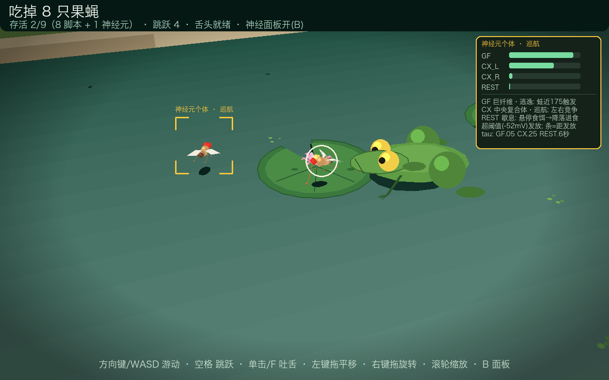
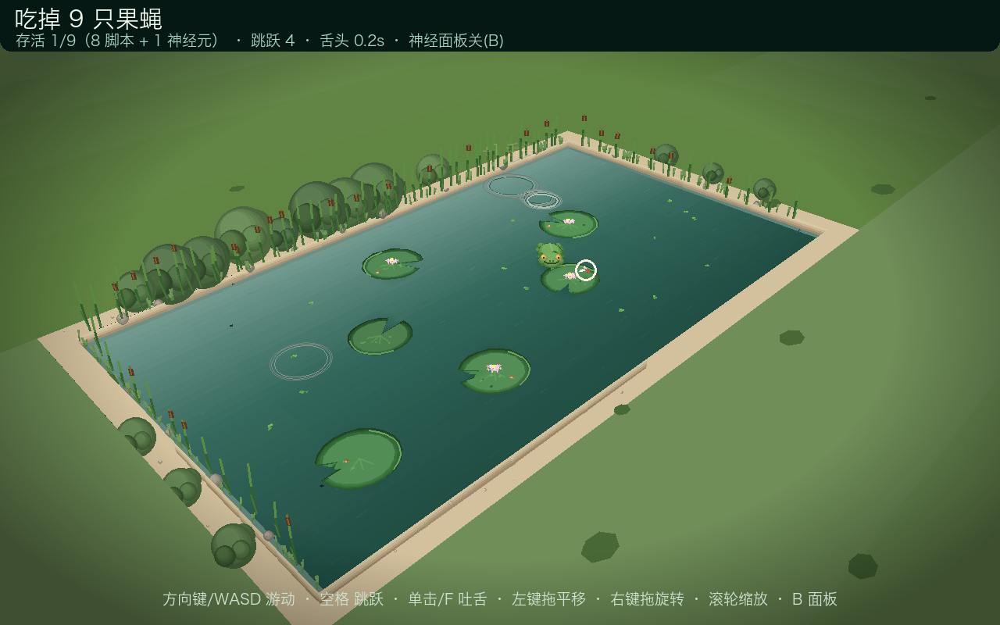

# 🐸 Fly Pond 3D 🪰

**A tiny 3D pond game written from scratch in Python.** You play a frog: hop across
lily pads, flick your tongue, and hunt fruit flies. Eight of the flies are ordinary
scripted NPCs — the ninth is driven by a **spiking neural network** and visibly
"thinks" before it decides to flee, cruise, or land for a meal.

[English](README.md) · [简体中文](README.zh-CN.md)



*The gold-outlined fly is the only one driven by a spiking network. Press `B` and the panel on the
right shows each circuit charging toward threshold in real time — here the frog has walked inside
GF's 170-unit escape radius and the giant-fibre bar is almost full.*

Built with nothing but `pygame` and `numpy` — no OpenGL, no engine, no assets.
Every polygon is projected, depth-sorted and drawn by hand in `render3d.py`.

## Highlights

- **Hand-rolled 3D renderer** — perspective projection, painter's algorithm,
  near-plane clipping, depth bias, and a two-layer draw order that stops the frog
  from sinking through the ground when it stands behind a big polygon.
- **One fly has a brain** — a conductance-free LIF spiking network drives escape,
  cruising and feeding decisions of a single gold-outlined fly. Press `B` to watch
  its membrane potentials charge and fire in real time.
- **Behaviourally detailed flies** — three-segment abdomen, jointed legs, wing veins;
  distinct animations for flying, walking (tripod gait), feeding (front legs rubbing
  the crumb) and grooming (wiping the compound eyes, a real *Drosophila* behaviour).
- **A living pond** — caustics, ripples, lily pads that bob on the water, lotus
  flowers, duckweed, sand banks, rocks, reeds, bulrushes, bushes and a hazy sky.
- **Procedural audio** — croak, splash, crunch, wing buzz and tongue snap are all
  synthesized into numpy buffers at startup. There is no sound file in this repo.
- **Headless regression test** — `--selftest` runs an autopilot frog that must catch
  flies before the run is allowed to pass.

## Quick start

Requires Python 3.10+ (developed on 3.14).

```bash
git clone https://github.com/yjiao286/fly-pond.git
cd fly-pond

python -m venv .venv
.venv/bin/pip install -r requirements.txt   # Windows: .venv\Scripts\pip

.venv/bin/python main.py
```

## Controls

| Input | Action |
|---|---|
| Arrow keys / `WASD` | Swim in the direction you push (the frog turns to face it) |
| `Space` | Hop — anything within 60 units of the landing spot is squashed |
| Left click / `F` | **Flick tongue** at the nearest target ahead (holding and dragging the left button pans the camera instead — no accidental tongue) |
| Right-drag | Orbit the camera — horizontal drag circles the pond, vertical drag sets the pitch between 10° and 62° |
| Mouse wheel | Zoom in / out |
| `B` | Neural panel: live GF / CX_L / CX_R / REST activation bars plus a legend |
| `M` | Mute |
| `F11` | Fullscreen / windowed |
| `Esc` | Quit |

## The one fly that thinks

The brain ([`fly_brain.py`](fly_brain.py)) is a small spiking network of leaky
integrate-and-fire neurons integrated with sub-stepping every frame. It is not a
decoration — the fly really does nothing until a circuit fires.

| Circuit | Role | Tau | Fires when |
|---|---|---|---|
| **GF** — giant fibre | Escape reflex | 0.05 s | The frog closes within ~170 units, or a hop shadow sweeps past → full-speed flight for 0.85 s + 1.6 s refractory |
| **CX_L / CX_R** — central complex | Steering | 0.25 s | Left/right oscillators compete; the difference with inertia produces smooth, non-repetitive cruising |
| **REST** — rest circuit | Feeding gate | 0.6 s | Membrane slowly charges while hovering over a crumb; crossing threshold releases the landing manoeuvre. Takes off again after 2.5 s without food, or 12 s of resting |
| Olfactory bias | Navigation | — | When hungry, headings are nudged toward the nearest crumb |

Threshold is −52 mV, resting potential −70 mV. The `B` panel draws a bar per neuron
showing how far it is from firing, so you can literally watch GF charge up as you
walk your frog toward the gold fly.

The other eight flies (`ScriptedFly`) use waypoint behaviour: forage → land → chew;
if the frog comes within 110 units they bolt. The neural fly reacts from much
farther away.

## Foraging loop

Crumbs grow on random lily pads. Flies smell them, hover, and then land to chew —
a pad's crumb shrinks and disappears when eaten, and a new one sprouts on some pad
8–14 s later. A fly that is busy feeding or grooming is **not** watching you, which
is exactly when to flick your tongue.



## How the 3D works

Everything lives in [`render3d.py`](render3d.py): a `Camera3D` doing perspective
projection with a yaw/pitch orbit rig, a `Painter` collecting polygons, and
primitives (`flat_polygon`, `sphere`, `segment`, `polyline`, `ellipse_pts`) with
near-plane clipping.

Naive painter's-algorithm sorting breaks the moment a small creature stands on the
far half of a huge ground polygon — the ground wins the sort and swallows the
creature. Fly Pond 3D solves it with **two draw layers**:

1. **Ground layer (drawn first):** water bands, caustics, every lily pad layer,
   crumbs and ripples — flat things always sit underneath.
2. **Main layer (drawn after, depth-sorted):** frog, flies, and the 3D bank walls,
   rocks, reeds and bushes.

Ground creatures additionally sample the lily-pad surface height (which follows the
wave animation), so feet rest *on* the leaf instead of sinking into it.

## Project layout

| File | Contents |
|---|---|
| [`main.py`](main.py) | Game loop, orbit camera rig, input, 3D frog, both fly classes, HUD, selftest |
| [`render3d.py`](render3d.py) | The mini 3D layer: `Camera3D`, `Painter`, projection, clipping, primitives |
| [`fly_brain.py`](fly_brain.py) | LIF spiking neurons and the `FlyBrain` circuit (GF / CX / REST) |
| [`scenery.py`](scenery.py) | Water, caustics, ripples, lily pads, lotus, crumbs, duckweed, banks, rocks, grass, reeds, bushes, sky |
| [`sounds.py`](sounds.py) | Procedurally synthesized sound effects |
| [`real_fly_demo.py`](real_fly_demo.py) | Experimental: render EPFL's NeuroMechFly model (see below) |

## Regression test

Headless autopilot — the frog must actually eat before the test passes:

```bash
.venv/bin/python main.py --selftest
```

```
[selftest] 吃掉=5 跳跃=0 存活=5 神经元果蝇GF逃逸反射=0次
[selftest] PASS ✓
```

For a quick look at the brain in isolation:

```bash
.venv/bin/python fly_brain.py
```

## Optional: the real fly brain

The in-game fly uses a lightweight hand-tuned circuit. Separately, this repo has been
used to install EPFL's [NeuroMechFly](https://neuromechfly.org) (flygym) — the real
Drosophila neuromechanical model — into a Python 3.12 + MuJoCo environment:

```bash
python3.12 -m venv .venv-flygym
.venv-flygym/bin/pip install -r requirements-flygym.txt
.venv-flygym/bin/python real_fly_demo.py     # writes real_fly.png
```

Note: flygym 2.1.0 is very new and its API differs from the published tutorials;
`real_fly_demo.py` currently trips over sensor naming inside the library's
`compose/base.py`. That is an upstream issue, not a bug in this repo — expect to
adapt the script once flygym ships a patch.

## Notes and limitations

- **The UI is in Chinese.** Fonts are auto-detected (macOS system CJK fonts first,
  then `pygame.font.match_font`), so on Windows or Linux the HUD may fall back to a
  font without CJK glyphs and show empty boxes. Fix it by adding a CJK `.ttf` path to
  `FONT_PATHS` in `main.py` (`main.py:38`).
- **Silent fallback.** Sound is synthesized into numpy buffers and played through
  `pygame.sndarray`; with no audio device the game still runs, just mute.
- **The neural fly is a gameplay model**, not a biophysical simulation — three
  hand-tuned LIF circuits reproduce the behaviours that are fun to watch and to
  learn from. For the real Drosophila model, see the NeuroMechFly section above.
- Tested on macOS with Python 3.14 / pygame-ce 2.5.8 and run headlessly in CI-style
  smoke tests; other platforms should work but are untested.

## License

[MIT](LICENSE) — do whatever you like, attribution appreciated.
