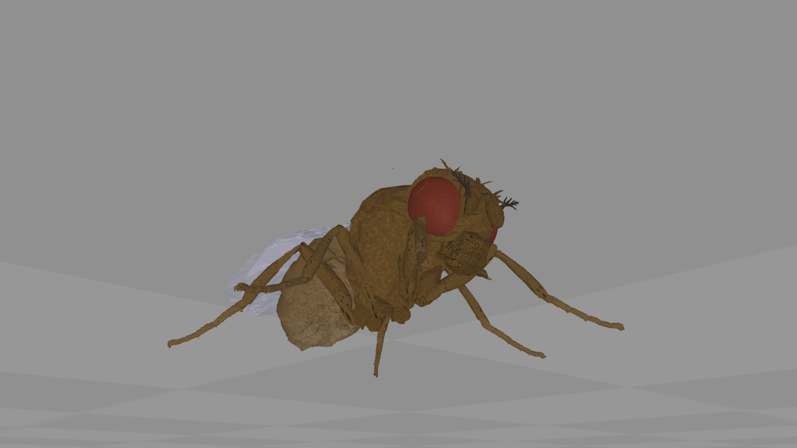
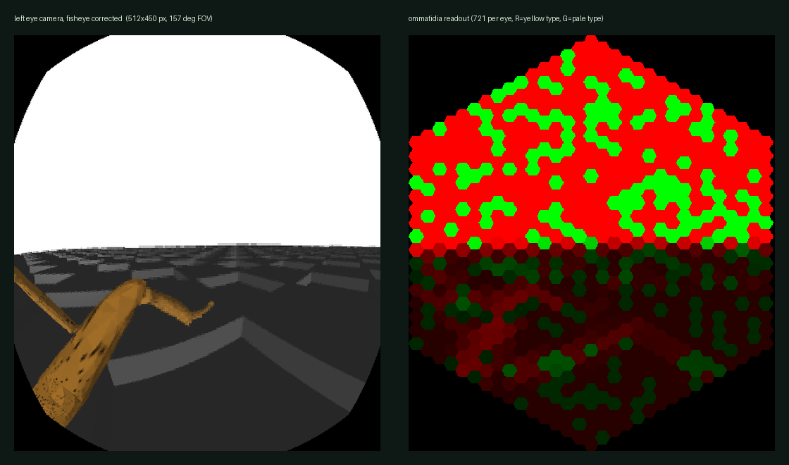
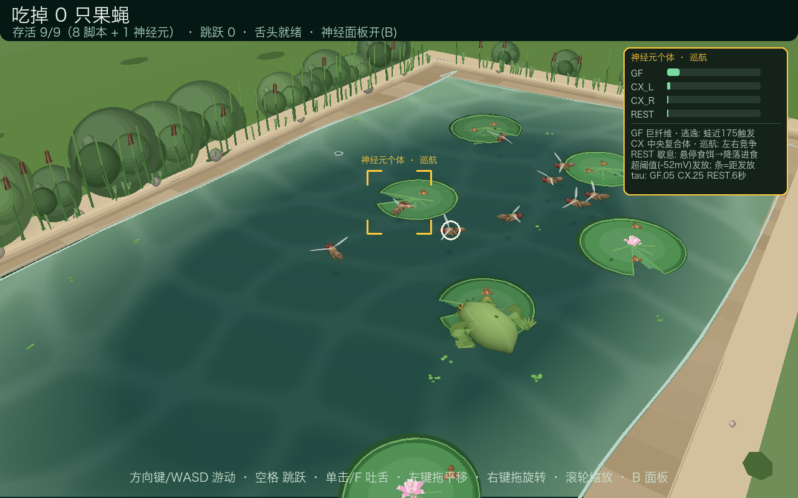

# 🧠 NeuroMechFly-3D-Pond

**A 60 FPS, engine-free 3D pond in ~2.3k lines of Python** — software-projected, software-shaded,
no OpenGL and no asset files beyond the source itself. Nine fly agents inhabit the pond; exactly
one of them is driven by a **spiking neural network** of leaky integrate-and-fire neurons
(giant-fibre escape reflex, central-complex steering, rest-gated feeding). The same repository
assembles, simulates and renders the **real NeuroMechFly** body model — micro-CT meshes,
126 rotational DoF, compound-eye readout — on MuJoCo.


[English](README.md) · [简体中文](README.zh-CN.md)



*MuJoCo offscreen render of the model assembled by [`real_fly_demo.py`](real_fly_demo.py): 70 body
segments, 126 rotational DoF, 132 actuators (126 position + 6 tarsal adhesion), 2 eye cameras.
Not a game asset — see [§5](#5--the-real-fly-flygym--neuromechfly-pipeline).*



*Vision interface of the same model. Left: left-eye camera (512 × 450 px, 157° FOV, fisheye
corrected). Right: the same frame resampled onto the hexagonal ommatidia mosaic — 721 per eye —
split by ommatidia type (R = yellow, G = pale). This mosaic is the retina's actual output; a
rectangular image never reaches the brain.*

---

## Contents

| § | Section |
|---|---|
| 1 | [System overview](#1--system-overview) |
| 2 | [The spiking agent](#2--the-spiking-agent) |
| 3 | [Renderer](#3--renderer) |
| 4 | [Scenery, modelling and materials](#4--scenery-modelling-and-materials) |
| 5 | [The real fly: FlyGym / NeuroMechFly pipeline](#5--the-real-fly-flygym--neuromechfly-pipeline) |
| 6 | [Related work](#6--related-work) |
| 7 | [Build, run, controls](#7--build-run-controls) |
| 8 | [Verification](#8--verification) |
| 9 | [Known limitations](#9--known-limitations) |

---

## 1 · System overview

Two independent stacks live in one repository. Stack A is the game: a deterministic simulation
loop plus a hand-written rasteriser. Stack B is the FlyGym bridge: it composes a scientific
MuJoCo model and renders it offline. They share no code beyond `V3 = pygame.math.Vector3`.

| Subsystem | File | LoC | Responsibility |
|---|---|---|---|
| Game loop, agents, HUD | [`main.py`](main.py) | 817 | 60 FPS fixed-step loop, frog kinematics, both fly classes, HUD, headless selftest |
| Software renderer | [`render3d.py`](render3d.py) | 671 | `Camera3D` perspective projection, `Painter` depth sorter, creature sprite pass, material primitives |
| Creature modelling | [`models.py`](models.py) | 473 | Shape spec tables, pose functions and shading for the frog and the fly |
| Neural agent | [`fly_brain.py`](fly_brain.py) | 155 | LIF neuron, GF / CX / REST circuits, sensory integration, motor commands |
| Scene | [`scenery.py`](scenery.py) | 814 | Per-pixel water and caustics, ripples, lily pads, crumbs, banks, props, sky, camera-keyed cache |
| Audio | [`sounds.py`](sounds.py) | 127 | Procedural synthesis at 22.05 kHz (croak, splash, crunch, wing buzz, tongue snap) |
| FlyGym bridge | [`real_fly_demo.py`](real_fly_demo.py) | 166 | Composes NeuroMechFly in MuJoCo, renders body + retina readouts |

Runtime invariants: window 1280 × 800 (`SCALED │ RESIZABLE`), 60 FPS cap, simulation timestep
clamped to 1/20 s to survive stalls, world units are ~mm-equivalent pond units, and every
randomised layout is seeded.

## 2 · The spiking agent

`fly_brain.py` implements `dv/dt = (−(v − v_rest) + I)/τ` with threshold-reset dynamics, integrated
in sub-steps of τ/2 for stability. Defaults: `v_rest = −70 mV`, `v_thr = −52 mV`,
`v_reset = −76 mV`; a spike is one sample of `fired`, and `activation ∈ [0,1]` is the normalised
distance to threshold — this is what the `B` panel plots.

| Circuit | FlyGym-free analogue | τ | Drive | Fires when |
|---|---|---|---|---|
| **GF** giant fibre | escape reflex | 0.05 s | `55 · max(0, 1 − d_frog/260)`, ×3 while airborne | threat inside ~170 units, or a hop shadow overhead → 0.85 s escape thrust ×3.1, then 1.6 s refractory; **habituates** to a repeatedly harmless stationary threat (current floor ×0.45 — still flees inside ~70 units), a hop shadow dishabituates instantly |
| **CX_L / CX_R** central complex | heading control | 0.25 s | two slow oscillators compete | read out as amplitude difference → smooth, aperiodic cruising |
| **REST** rest/arousal | feeding gate | 0.6 s | `45 · rest_fill` while hovering and threat < 0.32 | crossing threshold releases the landing manoeuvre; lands beside an occupied crumb and contests it — scripted flies yield (territoriality); abort after 3.5 s without food or 9 s of resting |
| Olfactory bias | chemotaxis | — | heading nudge toward the nearest crumb | hunger state |

The eight remaining agents (`ScriptedFly`) are finite-state waypoint controllers: forage → land →
chew, flee below 110 units (re-arm at 260). The spiking agent flees at ~170 units, which is the
observable difference between a threshold detector and a scripted trigger.

| | `ScriptedFly` | `BrainFly` |
|---|---|---|
| Decision source | state machine + tuned constants | LIF membrane potentials |
| Escape trigger | distance < 110 | GF threshold crossing (~170 fresh, ~70 once habituated) |
| Feeding | timer | REST gate |
| Introspection | none | `B` panel: per-neuron activation, live |
| Count in pond | 8 | 1 (gold bracket + label) |

## 3 · Renderer

No GPU, no depth buffer. The pipeline is: world → view transform → near-plane clip
(Sutherland–Hodgman, `NEAR = 14`) → perspective projection (`focal = 1050 px`) → deferred painter
submission → per-layer depth sort → blit. Polygons are queued as closures and executed in
`Painter.flush`, which is what makes explicit ordering control possible.

| Layer | Contents | Ordering rule |
|---|---|---|
| 0 `WATER` | per-pixel water image (ray-cast onto z=0) | flat, always first |
| 1 `FX` | shore line, ripples, duckweed | above water only |
| 2 `PAD` | reserved for pad decals | — |
| 3 `BANK` | bank walls, meadow, pebbles, rocks, bushes (cached), reeds, grass | depth-sorted, camera-keyed cache for static props |
| 4 `MAIN` | frog, flies, particles, tongue | depth-sorted, drawn last |

**One `bias` convention.** Every primitive now sorts by `depth - bias`, so a positive bias always
means "visually in front". `limb()` / `segment()` used to use `depth + bias` (positive = behind);
those two opposite meanings once turned "draw the front legs on top of the eyes" into "draw them
behind the eyes". Unifying them means you no longer have to remember which primitive is inverted.

**Why two layers matter.** Sorting a small creature against a huge ground polygon by mean depth
breaks as soon as the creature is on the far half of that polygon. Splitting the scene into
"flat, always underneath" and "volumetric, depth-sorted" removes the failure mode, and explicit
per-object `bias` values separate coplanar parts (leaf top / veins / underside, shadow vs. body).

**Creature sprite pass.** The frog and each fly are first drawn into their own 3x supersampled
canvas (a sub-camera is just the main camera's image plane, translated and scaled), depth-sorted
among themselves as usual, and then scaled back down into the scene. Silhouettes come out
anti-aliased, a creature never z-fights with itself, and it costs the scene a single draw item.

**Progressive anti-aliasing.** The static bank props depend only on the camera, so they live in a
cached image: once the camera rests for ~6 frames the cache is re-rendered at 2x and scaled back,
which smooths every sand/grass/bush outline; while orbiting it stays at 1x to keep the drag
responsive. Shapes that move every frame (lily pads) get an anti-aliased outline drawn over the
fill along the same edge. The water follows the same idea — analytic at 1/2 resolution when still,
1/3 while the camera moves, which halves the cost during orbit and is invisible in motion.

**Materials.** A single world-space key light (`LIGHT_XY`) drives all shading, so highlights stay
consistent under camera orbit:

| Primitive | Use | Shading model |
|---|---|---|
| `sphere()` | bushes, rocks, eyes, crumbs, joints | rim-darkened base → inset light-shifted layers → specular dot → outline; small-radius LOD |
| `dome()` | lily pads, pebbles, wing membranes, sheen bands | edge darkening → inset highlight toward the light → sheen |
| `loft()` | frog body, fly thorax/abdomen | one outline collapsed layer by layer into a smooth curved shading ramp |
| `limb()` | limbs, stems, wing veins | tapered capsule polygon (tangents + round caps) with a light-side face |
| `translucent_polys()` | wing membranes, toe webbing | one SRCALPHA surface, alpha-blended as a group |
| `soft_shadow()` | every grounded object | cached radial-falloff sprite scaled to the projected ellipse |
| `flat_polygon()` / `segment()` / `polyline()` | water, veins, stems, tongue | flat fill with depth bias |

Measured cost, headless software rendering with the entire pond in frame and a still camera:
**≈ 24 ms/frame** (1280 × 800 dummy SDL, Python 3.14, pygame-ce 2.5.8); orbiting the camera
costs ≈ 42 ms/frame because both the bank cache and the water plane are rebuilt. The water image
is rebuilt every 3rd frame (caustics are slow-moving) and the static bank layer only when the
camera rig changes — those two caches are where the headroom comes from.

## 4 · Scenery, modelling and materials



*Whole-system view, mid zoom. Everything on screen is generated at run time — water body, pads
with radial veins and lifted rims, wet-to-dry sand ramps, reeds and bushes. In the middle of the
pond sits the **neural individual**: the gold bracket labels its state (`巡航`), and the panel on
the right reads its four circuits live — GF is charging because the frog is inside the 170-unit
escape radius, CX_L/CX_R show the steering oscillators, REST is quiet.*

All geometry is generated at run time from seeded RNGs; the repository contains no mesh, no
texture and no audio file.

| Element | Model | Texture / shading |
|---|---|---|
| Water | pond plane ±620 × ±350, activity region ±545 × ±285 | every pixel is ray-cast onto the z=0 surface, then shaded analytically: depth tint, Fresnel sky reflection, a warped-sine caustic light net, foam at the waterline; the static part is cached per camera |
| Lily pads | 6 pads, r 46–66, notch + veins + optional lotus, bobbing on `sin(1.2t + φ) · 1.6` | radial veins tapering outward, lifted near-edge rim, leaf underside, soft contact shadow |
| Frog | one lofted body (30 collapsed layers along the spine), limbs folded into a Z, procedural toes with webbing, gold iris + horizontal pupil | dorsal highlight, mottling, dorsolateral folds, tympanum, jaw line, wet-skin sheen, water contact shadow |
| Flies (`FLY_SCALE = 1.85`, scaled up so they read at pond scale) | brick-red compound eyes (flattened ellipsoids), frons and three ocelli, amber thorax / scutellum / black bristles, tapering drooping banded abdomen, glassy translucent veined wings, six legs (coxa–femur–tibia–tarsus), halteres | per-part shading, alpha-blended wing membranes, soft shadows |
| Banks | 4 walls × 8 segments, 44-unit rim, meadow to 2600 units | wet→dry sand gradient, pebbles, rock speckle, bush clusters, haze-faded meadow, drifting clouds, horizon glow |

Shapes live as spec tables in [`models.py`](models.py) (half-width table, back-height table, joint
chains); pose functions interpolate between states. Modelling is "read the table, pose it", not a
long list of hand-tuned polygons.

**Food competition.** A crumb is a scarce resource (2.5–4 s to grow back), holds exactly
**one feeder at a time** (`FoodCrumb.CAPACITY = 1`), and each lily pad carries two crumbs
on opposite sides:

- pick cost = `distance ÷ free slots × individual bias (0.8–1.2)`, and fresher crumbs are
  worth a longer flight — so flies spread out over pads instead of herd-rushing the single
  free seat;
- a fly en route **reserves its seat** by "closest claimant wins": seats are counted
  from its own distance outwards, only claimants strictly closer count against it —
  two equidistant waiters can never each see the other as blocking (at capacity 1
  this used to deadlock: both saw "full", neither dared to land). The start-eating
  gate is sticky (whoever is eating keeps the seat, a newcomer requires an empty
  one), which closes the same-frame landing race;
- when the target is full a fly **loiters on a wide, slow circle** (turn rate varies per
  individual so the circles don't overlap); a crumb nearly eaten bare (< 0.8 left) or a
  3.5 s wait means moving on — waiting stays a brief contested moment, never an orbit;
- **the neural fly is territorial**: the pad it lands on is its territory, and the
  contest is fully choreographed — it turns to face the occupant and repeatedly
  **lunges** (rears up, thrusts its front legs at the opponent — the signature move
  of real Drosophila aggression) with quick **wing-threat** flicks, while the
  feeding scripted fly crouches, trembles, backs away and abandons its crumb
  within half a second. Measured, it alone takes ~35% of all pond feeding time
  (the 9-fly average is 11%) — the gold frame is not just a label, the
  competitive edge is visible;
- fleeing releases the claim so the seat frees up immediately; the neural fly leaves when
  satiated (hunger < 0.05) instead of eating a crumb down to nothing.

Measured over four minutes (frog stationary): exactly one feeder per crumb (0.0%
overshoot); loiter median 0.5 s, longest ~4 s (seat-change transitions, not stuck
waits); no "circling but never eating" stretch past 8 s.

Pose and gait logic covers four fly states — flight (22 Hz beat with the wing tips arcing up and
down while the wings sweep fore/aft, legs trailing back), walking (tripod gait with a real swing
phase that lifts each foot, step frequency ∝ speed), feeding (mouthparts reaching the crumb,
front legs rubbing), grooming (front legs swept **above the head outline** in a wide arc for 1.6 s, body tilted back,
wings quivering; every 2.5–5 s, 13% of all fly-frames — the real *Drosophila* cleaning behaviour). Wing spread is interpolated from altitude, so taking off and landing unfold
and fold smoothly instead of snapping between two poses.

## 5 · The real fly: FlyGym / NeuroMechFly pipeline

[`real_fly_demo.py`](real_fly_demo.py) composes EPFL's
[NeuroMechFly](https://neuromechfly.org) through the FlyGym 2.x composition API and renders it
offscreen — the two images at the top of this page are its output.

| Stage | API call | Result |
|---|---|---|
| Body | `NeuroMechFly()` + `colorize(visuals.yaml)` | 70 micro-CT body segments, materials applied |
| Articulation | `Skeleton(AxisOrder.PITCH_YAW_ROLL, JointPreset.ALL_BIOLOGICAL)` + `add_joints()` | 126 rotational DoF, per-joint stiffness / damping / armature |
| Actuation | `add_actuators(..., ActuatorType.POSITION)` | 126 position actuators — the muscle proxy |
| Adhesion | `add_leg_adhesion()` | 6 tarsus5 adhesion actuators, `ctrl ∈ [0,1]` |
| Vision | `add_vision()` | 2 eye cameras → `get_raw_vision()` and `get_ommatidia_readouts()` |
| Physics | `FlatGroundWorld` / `BlocksTerrainWorld` + `Simulation` | MuJoCo 3.9, 1 ms timestep |

Interfaces exposed to a controller (i.e. what a neural circuit would read and write):

| Direction | Channel | Resolution |
|---|---|---|
| sense | vision | 2 × 721 ommatidia, yellow/pale split, 157° FOV per eye, fisheye model |
| sense | proprioception | joint angles + velocities for all 126 DoF |
| sense | mechanosensation | per-segment contact forces (per-leg ground sensors on simple worlds) |
| act | motor | 126 joint targets + 6 adhesion channels |

```bash
python3.12 -m venv .venv-flygym                  # FlyGym 2.1.0 requires Python 3.12+
.venv-flygym/bin/pip install -r requirements-flygym.txt
.venv-flygym/bin/python real_fly_demo.py         # → docs/images/{neuromechfly,fly-vision}.png
```

```
NeuroMechFly: 70 个体节 / 126 个关节自由度 / 132 个执行器（含 6 个足端附着）/ 2 个复眼相机
```

First run is dominated by Numba JIT on the retina path (~1 min); later runs render in seconds.
`pip install "flygym[warp]"` enables the MuJoCo-Warp backend for batched simulation;
`"flygym[rl]"` adds Gymnasium + Stable-Baselines3 for locomotion policies.

### Game agent vs. scientific model

| | Game fly ([`fly_brain.py`](fly_brain.py)) | NeuroMechFly |
|---|---|---|
| Body | a few dozen generated polygons | 70 micro-CT meshes |
| Articulation | kinematic, scripted gaits | 126 DoF with joint dynamics |
| Controller | 4 hand-tuned LIF circuits | user-supplied circuit / CPG / RL policy |
| Vision | distance checks | 721-ommatidia retina per eye |
| Timestep | 1/60 s, pure Python | 1 ms, MuJoCo |
| Purpose | interaction and pedagogy | sensorimotor neuroscience |

## 6 · Related work

Context for the spiking agent: *Drosophila* is the only animal with a complete adult brain wiring
diagram, and those diagrams are now being coupled to simulated bodies.

| Work | Contribution | Link |
|---|---|---|
| FlyWire whole-brain connectome | 139,255 neurons, ~5 × 10⁷ chemical synapses | [Dorkenwald et al., *Nature* 634, 124–138 (2024)](https://doi.org/10.1038/s41586-024-07558-y) · [flywire.ai](https://flywire.ai) · [annotations](https://github.com/flyconnectome/flywire_annotations) |
| Whole-brain annotation and cell typing | cell types and cross-individual stereotypy | [Schlegel et al., *Nature* 634, 139–152 (2024)](https://doi.org/10.1038/s41586-024-07686-5) |
| Computational whole-brain model | connectome-constrained model reproducing sugar sensing and feeding | [Shiu et al., *Nature* 634, 210–219 (2024)](https://doi.org/10.1038/s41586-024-07763-9) |
| Hemibrain connectome | the central-brain reconstruction that opened the field | [Scheffer et al., *eLife* 9:e57443 (2020)](https://doi.org/10.7554/eLife.57443) |
| Male nerve cord connectome | descending commands → motor output | [Takemura et al., *eLife* (2024)](https://doi.org/10.7554/eLife.97769) |
| **NeuroMechFly v2 / FlyGym** | embodied neuromechanics — the model installed and rendered here | [Wang-Chen et al., *Nature Methods* 21, 2353–2362 (2024)](https://doi.org/10.1038/s41592-024-02497-y) · [neuromechfly.org](https://neuromechfly.org) · [NeLy-EPFL/flygym](https://github.com/NeLy-EPFL/flygym) |
| FlyBody | whole-body physics with connectome-derived neuromuscular wiring | [Vaxenburg et al., *Nature* (2025)](https://doi.org/10.1038/s41586-025-09029-4) · [TuragaLab/flybody](https://github.com/TuragaLab/flybody) |
| Connectome-constrained deep mechanistic networks | single-neuron visual responses from optic-lobe wiring | [Lappalainen et al., *Nature* 634 (2024)](https://doi.org/10.1038/s41586-024-07939-3) · [TuragaLab/flyvis](https://github.com/TuragaLab/flyvis) |

## 7 · Build, run, controls

```bash
git clone https://github.com/yjiao286/NeuroMechFly-3D-Pond.git
cd NeuroMechFly-3D-Pond

python -m venv .venv
.venv/bin/pip install -r requirements.txt        # Windows: .venv\Scripts\pip

.venv/bin/python main.py
```

Requires Python 3.10+ (developed on 3.14); dependencies are `pygame-ce` and `numpy` only.

| Input | Action | Implementation detail |
|---|---|---|
| Arrows / `WASD` | swim | velocity = 175 u/s, heading smoothed with an exponential turn rate |
| `Space` | hop | 310 u over 0.62 s, quadratic arc, 62 u peak; 60 u kill radius on landing |
| Left click / `F` | tongue strike | 200 u range, 17 u capture radius, ±1.15 rad cone, 0.30 s cycle |
| Left-drag | pan camera | grab-style pan, speed ∝ zoom |
| Right-drag | orbit camera | yaw free, pitch clamped 18°–62° |
| Wheel | zoom | distance clamped 420–3200, default 1526 |
| `B` | neural panel | GF / CX_L / CX_R / REST activation bars + legend |
| `M` / `F11` / `Esc` | mute / fullscreen / quit | — |

## 8 · Verification

```bash
.venv/bin/python main.py --selftest      # 1800-frame headless autopilot, asserts ≥ 1 catch
.venv/bin/python tools/preview.py frog   # model contact sheet: frog turntable (fly/close/pond/wide/doc)
.venv/bin/python fly_brain.py            # isolated circuit probe: reports GF spike time/distance
```

```
[selftest] 吃掉=5 跳跃=1 存活=5 神经元果蝇GF逃逸反射=0次
[selftest] PASS ✓
t=3.80s 距离=171px → 巨纤维发放，状态=逃逸
```

The selftest drives the frog with a scripted policy under `SDL_VIDEODRIVER=dummy`, so rendering
and physics are exercised without a display. Frame-cost figures quoted above were measured the
same way (`Game.draw()` in a 60-iteration loop, warm cache).

## 9 · Known limitations

- **UI strings are Chinese.** Fonts are resolved from macOS system CJK faces, then
  `pygame.font.match_font`; on Windows/Linux add a CJK `.ttf` to `FONT_PATHS` (`main.py:39`).
- **Audio is best-effort.** Effects are synthesized into numpy buffers and played via
  `pygame.sndarray`; with no audio device the game runs silently.
- **The game agent is a behavioural model, not a biophysical one** — four hand-tuned LIF circuits
  chosen for readability and interaction latency. The scientific model is
  [§5](#5--the-real-fly-flygym--neuromechfly-pipeline).
- **FlyGym 2.1.0 sensor naming.** Per-leg ground-contact sensors reference element names that do
  not exist, so `real_fly_demo.py` composes with `add_ground_contact_sensors=False`; contact
  forces remain available through `get_bodysegment_contact_forces()`. Upstream issue.
- Verified on macOS (Python 3.14, pygame-ce 2.5.8, MuJoCo 3.9 / FlyGym 2.1.0 on Python 3.12);
  other platforms are untested.

## License

[MIT](LICENSE). Cited third-party projects and datasets remain under their own licences.
